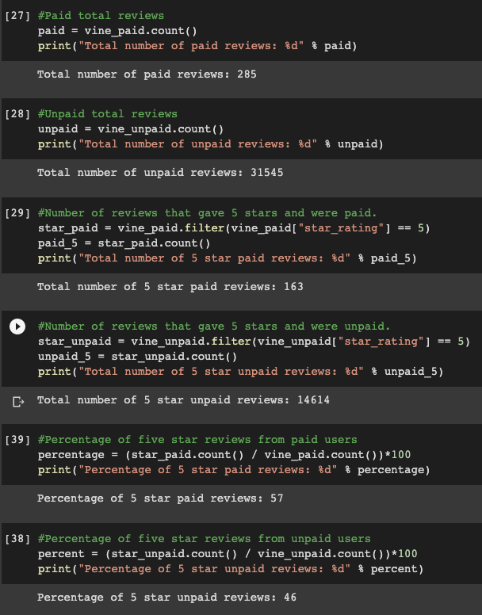

# Amazon_Vine_Analysis
### In this project, you’ll have access to approximately 50 datasets. Each one contains reviews of a specific product, from clothing apparel to wireless products. You’ll need to pick one of these datasets and use PySpark to perform the ETL process to extract the dataset, transform the data, connect to an AWS RDS instance, and load the transformed data into pgAdmin. Next, you’ll use PySpark, Pandas, or SQL to determine if there is any bias toward favorable reviews from Vine members in your dataset. Then, you’ll write a summary of the analysis for Jennifer to submit to the SellBy stakeholders.

## Deliverable 1: Perform ETL on Amazon Product Reviews 
### The data was broken down into four dataframes (customers_table, products_table, reivew_id_table, vine_table).  All dataframes were then linked to pgAdmin and verified that all data was available.

## Deliverable 2: Determine Bias of Vine Reviews
### The vine_table dataframe was re-created for this deliverable to determine if there is any bias towards reviews that were written as part of the Vine program. In the image below we can see that there are significanlty fewer paid reviews but the paid reviews are more likely to provide five stars.

## Summary
### Based on the analysis performed in this project we found that there is an eleven point difference in five star reviews between paid and unpaid reviewers.  The percentage of five star reviews for paid reviewers was 57%, while 46% of unpaid reviewers left a five star review.  It can be determined that paid vine reviewers are more likely to leave a five star review than unpaid.  